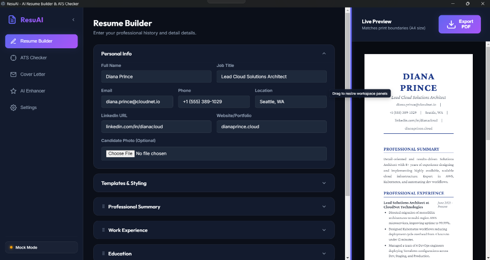
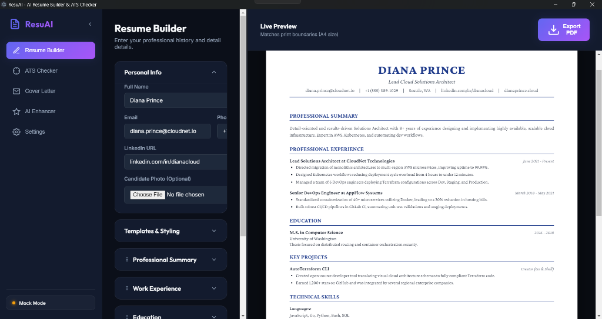

# CVitron - AI Resume Builder & ATS Optimizer


*Interactive workspace with resizable panels and hover tooltips.*


*A4 document preview showing professional experience and formatting styles.*

CVitron is a premium, feature-rich desktop application built with Electron, HTML5, CSS3, and JavaScript, integrated with the Google Gemini API. It empowers users to create professional, ATS-optimized resumes, evaluate job description compatibility, polish experience descriptions, generate tailored cover letters, and export print-ready PDFs.

---

## Key Features

- 🛠️ **Interactive Resume Builder**: Manage personal information, experience, education, projects, technical skills, and custom sections (like certifications or publications) in one dynamic form dashboard.
- 🖼️ **Optional Candidate Photo**: Toggle profile pictures on/off with base64 data encoding, adjusting header layouts automatically.
- 🎨 **10 Professional Themes**: Switch between 10 hand-crafted resume templates (including *Executive, Tech Minimal, Creative Split, Modern Teal, Bold Monospace, Startup Purple, and Elegant Emerald*) with adjustable font scaling and page margins.
- 📊 **ATS Compatibility Scanner**: Paste any job description to evaluate your resume match score, identify missing keywords, and get action-oriented bullet point suggestions.
- 💡 **AI Paragraph Enhancer**: Polishes raw descriptions using the **STAR Method** (Situation, Task, Action, Result) or other tones (confident, concise, academic). Includes inline "AI Improve" buttons directly in the builder forms.
- ✉️ **Cover Letter Generator**: Auto-drafts customized, high-converting cover letters matching your resume to target job requirements.
- 📄 **Pixel-Perfect PDF Export**: Export clean vector PDFs utilizing Electron's print renderer or standard web print fallback styles.
- 🔒 **Local & Secure**: Keeps draft state saved in your browser's localStorage and saves API keys safely on your machine. Includes a toggleable **Mock Mode** to test AI features offline without a key.

---

## Tech Stack

- **Desktop Framework**: [Electron](https://www.electronjs.org/)
- **Core Frontend**: Vanilla HTML5, CSS3 (Glassmorphic dashboard base, print media templates), and JavaScript (ES6+)
- **AI Integration**: [Google Gemini API](https://ai.google.dev/) (Zero-dependency direct HTTPS fetch integration)
- **CI/CD Automation**: GitHub Actions (releases compilation & web hosting pages deployment)

---

## Local Development Setup

### Prerequisites
Make sure you have [Node.js](https://nodejs.org/) installed.

### Installation
1. Clone or download this project folder.
2. Open a terminal inside the project directory and install dependencies:
   ```bash
   npm install
   ```

### Running Locally
To launch the Electron desktop application:
   ```bash
   npm start
   ```

### Packaging & Compiling Installers
- **Build Unpackaged Binaries**: Runs compilation checks and outputs raw binaries to `dist/win-unpacked`:
  ```bash
  npm run pack
  ```
- **Compile Single-file Installer**: Builds a standalone Windows installer (`.exe`) inside the `dist/` directory:
  ```bash
  npm run dist
  ```

---

## Deployment & Hosting

This project includes pre-configured CI/CD workflows under `.github/workflows/`:

### 1. Web Version (GitHub Pages)
The project is configured to automatically host the web version on GitHub Pages using [deploy.yml](.github/workflows/deploy.yml):
- Push commits to the `main` branch.
- In your GitHub Repository, go to **Settings** -> **Pages**.
- Set the **Source** to **GitHub Actions**.
- Open the live URL provided in the Actions log. The web version gracefully utilizes browser `window.print()` as a fallback for PDF generation!

### 2. Desktop Releases (GitHub Releases)
The project packages and distributes installers automatically using [build.yml](.github/workflows/build.yml):
- Push a version tag to your repository (e.g. `v1.0.0`):
  ```bash
  git tag v1.0.0
  git push origin v1.0.0
  ```
- The Actions tab will compile the Windows executable and attach the compiled installer to a draft release on your repository's Releases page.
